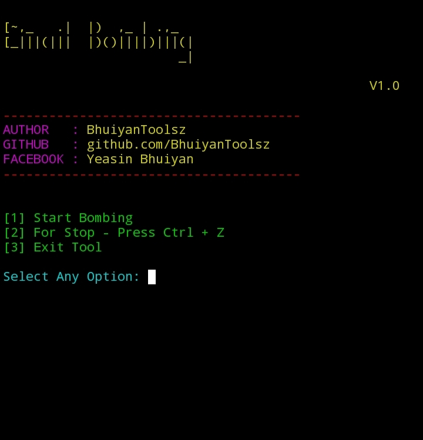

<h1 align="center">EMAIL BOOMBING TOOL</h1>

  
  
  
  

---

<h2>Features</h2>
<ul>
  <li>🎯 <strong>Simple &amp; Easy Interface</strong> – Beginner-friendly usage</li>
  <li>🎨 <strong>Colorful CLI Menu</strong> – Attractive terminal UI with colors</li>
  <li>📩 <strong>Custom Target Email</strong> – Send to any email address you choose</li>
  <li>🔢 <strong>Email Count Control</strong> – Set how many emails to send</li>
  <li>✍ <strong>Custom Message Support</strong> – Write and send your own message</li>
  <li>⚡ <strong>Fast Sending</strong> – Delivers multiple emails quickly</li>
  <li>🛑 <strong>Manual Stop Option</strong> – Stop instantly with <code>Ctrl + Z</code></li>
  <li>🛠 <strong>Cross-Platform</strong> – Works on Termux and Linux</li>
  <li>🔒 <strong>Secure SMTP Connection</strong> – Supports TLS / STARTTLS</li>
</ul>

<h2>📥 Installation</h2>

<strong>Just copy and paste the commands below 👇</strong>

<pre style="background:#f4f4f4; padding:10px; border:1px solid #ccc;"><code>
pkg update && pkg upgrade
pkg install python
pkg install git
pkg install python git -y
pip install requests
git clone https://github.com/BhuiyanToolsZ/Powerful-Email-Bombing.git
cd Powerful-Email-Bombing
python email_bombing.py
</code></pre>

<h2 style="color:purple;">Usage</h2>
<ul>
<li>Run the tool with <code>python email_bombing.py</code></li>
<li>Choose option <strong>1</strong> to start bombing</li>
<li>Enter target Valid Email  <code></code></li>
<li>Enter amount of SMS to send</li>
<li>Use <strong>Ctrl + Z</strong> to stop anytime</li>
<li>Choose option <strong>3</strong> to exit the tool</li>
</ul>

<h2 style="color:darkred;">Important Notes</h2>
<ul>
<li>Make sure your device has internet connection</li>
<li>Use responsibly &amp; never for illegal activities</li>
<li>This tool is for educational &amp; testing purposes only</li>
</ul>

  ⚠️This tool is made for educational purposes only.
Do not use it for illegal activities.
You are fully responsible for your own actions while using this tool.
Developer is not responsible for any kind of misuse or damage.
<h2 align="center">🙋‍♂️ Developer Info</h2>

  
  
  
  
  
   

</html>
